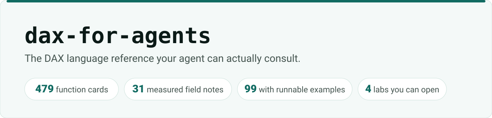
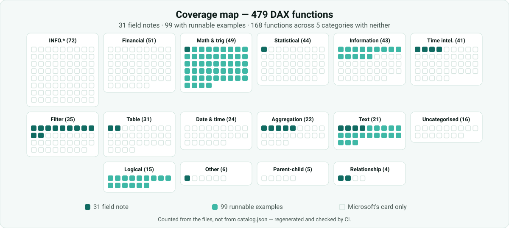

# dax-for-agents

<picture>
  <source media="(prefers-color-scheme: dark)" srcset="docs/assets/banner-dark.svg">
  
</picture>

**The canonical DAX language reference for AI agents** — every function with its signature,
semantics, and the gotchas the documentation doesn't tell you.

> **The long read** (in Spanish): [DAX para que tu agente deje de
> inventar](https://csalcedodatabi.com/blog/dax-for-agents/) — why the gap exists, one field
> note shown in full, and a map of what this library actually covers.

## What you are getting, exactly

| | |
|---|---|
| **479 function cards** | derived from `MicrosoftDocs/query-docs` ([gone since 2026-08](#the-upstream-is-gone)), one file each |
| **99 functions with runnable examples** | three each, every one carrying the result the engine returned |
| **34 conceptual pages** | evaluation context, `EVALUATE`/`DEFINE`, operators, glossary |
| **31 field notes** | hand-written. Each one carries the query that proves it and the number it returned |
| **4 lab scenarios** | runnable `.pbip` models. Download, refresh, run the queries yourself |
| **5 skills** | routed by `INDEX.md`, ~806 tokens of descriptions always on |

An agent reads `catalog.md` once, finds the function, opens **one** card. The other 376,000
tokens never enter the context window.

**And what you are not getting.** The 31 field notes are the highest-traffic functions, not
coverage of 479. Runnable examples reach further than the notes but still nowhere near all the
cards; the rest carry only Microsoft's own examples, marked as what they are — written against
a model that is not here. Growing that number is
[epic #6](https://github.com/CSalcedoDataBI/dax-for-agents/issues/6).

And the gap is not spread evenly, which a sentence cannot show and a map can:

<picture>
  <source media="(prefers-color-scheme: dark)" srcset="docs/assets/coverage-dark.svg">
  
</picture>

Math & trig, Text and Logical are covered almost end to end — the examples were written by
whole categories, not scattered. Five categories are still entirely blank, and the largest of
them, `INFO.*`, is also the largest category in the catalogue. That is where epic #6 pays best.

Both images are generated by `scripts/render_readme_assets.py` and **counted from the files
rather than from `catalog.json`**, which is not a reliable mirror of what is on disk. CI fails
if the tree moves and they do not.

The count in that table is checked from two directions, which is the only reason it is written
here at all. `check_doc_claims.py` fails if the sentence and the tree disagree, and
`check_examples.py` holds a floor (`MIN_COVERED`) that refuses to go backwards, so a deleted
example fails the build instead of quietly shrinking the library:

```bash
python scripts/check_examples.py
```

**It does not replace DAX experts.** It stops your agent from inventing functions that don't
exist.

## The upstream is gone

`MicrosoftDocs/query-docs` — the repository every generated card derives from — **no longer
exists**. Since August 2026 it returns 404 on `github.com` and on the API alike, without
authentication, and no successor was found in the organisation or among its forks. The last
commit this repository read was `616f1e8`, on 2026-08-24.

The name stays written wherever attribution requires it, because that is what CC BY 4.0 asks
for. The links do not, because a 404 attributes nothing. What is left instead:

- [The Wayback snapshot of 2026-03-01](http://web.archive.org/web/20260301020123/https://github.com/MicrosoftDocs/query-docs)
- [The DAX documentation on Microsoft Learn](https://learn.microsoft.com/en-us/dax/), which is
  the published form of the same material

Two consequences that are **not** yet fixed, tracked in
[issue #7](https://github.com/CSalcedoDataBI/dax-for-agents/issues/7):

- `sync-check.yml` polls a repository that cannot answer, so the weekly drift check can no
  longer tell "unchanged" from "unreachable".
- 89 image URLs, spread over 37 files under `generated/`, point at `raw.githubusercontent.com`
  paths that are now 404. The prose of those cards is intact; their screenshots are not.

This is also the argument for the shape of this repository. A derived copy, versioned and
gated, survives its source disappearing. A link does not.

## Why this exists

The agentic Power BI ecosystem is well covered on *tooling* and empty on *language*:

| Project | Covers |
|---|---|
| [`microsoft/skills-for-fabric`](https://github.com/microsoft/skills-for-fabric) | Fabric operations. No DAX as a language |
| [`data-goblin/power-bi-agentic-development`](https://github.com/data-goblin/power-bi-agentic-development) | Semantic models, TMDL, reports — and **DAX performance** |
| [`MicrosoftDocs/Agent-Skills`](https://github.com/MicrosoftDocs/Agent-Skills) | Azure skills. None for Power BI or DAX |
| [`daxlib/daxlib`](https://github.com/daxlib/daxlib) | A package registry for DAX UDFs |

None of them answers *"what does this function do, when does it bite, and what should I use
instead"* in a form an agent can consult without guessing.

## Complements, not competitors

- **Performance tuning** → use the `dax` skill in
  [data-goblin/power-bi-agentic-development](https://github.com/data-goblin/power-bi-agentic-development).
  This repo deliberately does not duplicate it.
- **Human-facing reference** → [dax.guide](https://dax.guide),
  [daxpatterns.com](https://www.daxpatterns.com) and
  [daxformatter.com](https://www.daxformatter.com) by SQLBI. Better than anything here for a
  person reading with their own eyes.
- **Ready-made UDFs** → [daxlib.org](https://daxlib.org). Indexed offline in `skills/dax-lib/`.

## Skills

| Skill | Use it when |
|---|---|
| `dax-reference` | You need what a DAX function does, its signature, or which one to reach for |
| `dax-lib` | Before writing a UDF from scratch — someone may have shipped it already |
| `dax-lib-install` | `dax-lib` found one and you want it *in* the model, licensed and attributed |
| `dax-udf-authoring` | Writing your own `FUNCTION`: parameter types, `VAL` vs `EXPR`, GA limits |
| `dax-window-functions` | `WINDOW` / `OFFSET` / `INDEX` / `RANK` — rolling, running totals, ranking |

Full routing: **[INDEX.md](INDEX.md)**.

## The lab

A claim about DAX is worth what you can run. `lab/` holds four Power BI projects that open
on your machine — no account, nothing to configure. Each one reads its Parquet tables over
HTTPS from a public data repo, so a `.pbip` of a few kilobytes is all that is versioned here.

| scenario | what only it can show |
|---|---|
| `contoso` | the model 30 of the 31 field notes were measured against |
| `blancos` | a blank in a numeric column: which functions count it and which skip it |
| `claves-huerfanas` | orphan foreign keys, and the blank row the engine adds on its own |
| `rendimiento` | 2,000,000 rows, for comparing what a query plan actually costs |

`lab/check_lab.py` runs the published queries against a model you have open and compares
the results, so a field note is a test and not an assertion. It needs a tabular engine with
the data loaded, which is why it is a local tool and not a CI job.

## Install

As a plugin — **needs Claude Code 2.1.142 or newer** (see below):

```bash
/plugin marketplace add CSalcedoDataBI/dax-for-agents
```

```bash
/plugin install dax@dax-for-agents
```

The skills arrive as `dax:dax-reference`, `dax:dax-lib`, `dax:dax-lib-install`,
`dax:dax-udf-authoring` and `dax:dax-window-functions`. Around 806 tokens of descriptions are
always on; everything else is read only when a question needs it. That figure is measured, not
estimated, and re-measuring it is one command — worth running whenever a skill is added or its
description is rewritten, because the number moves and nothing here checks it:

```bash
claude plugin details dax@dax-for-agents
```

Or as a submodule, which also works before a marketplace entry exists. The skills live
under `skills/`, so point the submodule at the repo and let the plugin root be the repo
root — not at `.claude/skills`, which would nest them one level too deep:

```bash
git submodule add https://github.com/CSalcedoDataBI/dax-for-agents.git vendor/dax-for-agents
```

### Why the version floor

The five skills sit under `skills/`, the same layout Microsoft ships in
[`skills-for-fabric`](https://github.com/microsoft/skills-for-fabric): one folder per
skill, and `.claude-plugin/plugin.json` naming each one by path. That list is not
decoration — it is what makes the shipped set reviewable in a diff — but it is no longer
the only thing standing between the plugin and an empty install, because `skills/` is
also where the default scan looks.

That difference is why the floor exists at all. Claude Code only started reading a skill
path that points at a directory holding `SKILL.md` in **2.1.142**. Measured by bisecting
the published releases against the older flat layout: on 2.1.141 the plugin installed,
reported success and loaded **zero** skills, because when none of the listed paths
resolve it silently falls back to scanning `skills/` — which back then did not exist.
`scripts/check_plugin_manifest.py` keeps the manifest and the tree in step so that
failure cannot come back quietly.

## Checking it yourself

Nothing here asks to be taken on trust. The prose is checked against the tree by a gate,
and so is everything else that can be:

```bash
python scripts/validate_skills.py        # frontmatter, INDEX, catalogue/cards/notes integrity
python scripts/check_doc_claims.py       # inventory counts in the prose against what is on disk
python scripts/check_examples.py         # 3 examples per covered function, each with a result
python scripts/check_plugin_manifest.py  # the manifest against the skills on disk
python -m unittest discover -s scripts -t scripts
```

`check_doc_claims.py` is the one worth knowing about: it reads a number written next to a
noun this repository counts — cards, functions with runnable examples, concepts, notes,
skills, workflows, lab scenarios, tests, plugins — and fails if the tree disagrees. **That
list is the whole scope**: a number about anything else, including estimates like the 376,000
tokens above, is not a promise this repository can keep, so the gate leaves it alone. The
counts at the top of this file are kept honest by it, not by anyone remembering to update
them.

Coverage is the noun that needs a qualifier, and the reason is worth stating: the phrase has
to say *functions*, not *examples*. A bare `examples` noun would read "three examples per
function" as a claim that the library holds three, and a gate that cries wolf on correct prose
is a gate someone switches off.

## Licensing

| What | Licence |
|---|---|
| Code, skills and hand-written content | [MIT](LICENSE) © 2026 CSalcedoDataBI |
| `skills/dax-reference/generated/` | **CC BY 4.0** © Microsoft — derived from `MicrosoftDocs/query-docs` ([gone since 2026-08](#the-upstream-is-gone)). See [`skills/dax-reference/NOTICE`](skills/dax-reference/NOTICE) |
| `skills/dax-lib/` | An offline index of [daxlib.org](https://daxlib.org). No package code is redistributed; licences vary per author. See [`skills/dax-lib/NOTICE`](skills/dax-lib/NOTICE) |
| The lab's Parquet data | MIT, and **synthetic** — generated, not sourced. It lives in [`CSalcedoDataBI/SampleDataSets`](https://github.com/CSalcedoDataBI/SampleDataSets) |

"Contoso" is Microsoft's fictional-company name, used here the way its own samples use it.
The data behind it is generated, and no Microsoft dataset is redistributed.
