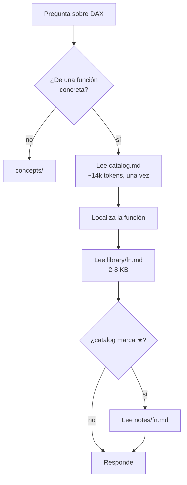

# dax-for-agents — diseño

**Fecha:** 2026-08-06
**Estado:** aprobado por secciones, pendiente de revisión final
**Repo destino:** `CSalcedoDataBI/dax-for-agents` (privado al inicio, público al liberar)
**Repo de origen del estudio:** un repositorio privado anterior, que se queda como está

---

## 1. Por qué

El estudio de mercado (2026-08-06, referencias en `knowledge/KNOWLEDGE.md`) encontró que el
ecosistema de agentes para Power BI está bien cubierto en *tooling* y vacío en *lenguaje*:

| Actor | ★ | Licencia | Cubre |
|---|---|---|---|
| `microsoft/skills-for-fabric` | 945 | MIT | Fabric. Cero DAX como lenguaje |
| `data-goblin/power-bi-agentic-development` | 839 | **GPL-3.0** | 11 plugins, 32 skills. Su skill `dax` es **solo rendimiento** |
| `MicrosoftDocs/Agent-Skills` | 686 | CC BY 4.0 | 191 skills de Azure. **Cero** de Power BI, DAX, M o Fabric |
| `MinaSaad1/pbi-cli` | 436 | MIT | CLI TOM+PBIR. Capa de ejecución |
| `daxlib/daxlib` | 72 | MIT | Registro de paquetes UDF. No es referencia del lenguaje |

**Nadie tiene una referencia del lenguaje DAX consumible por un agente.** La referencia para
humanos sí tiene dueño y es fuerte (SQLBI: `dax.guide`, `daxpatterns.com`, `daxformatter.com`);
no se compite ahí.

El sustrato para construirla existe y es legalmente reutilizable:
`MicrosoftDocs/query-docs`, **CC BY 4.0** (docs) + MIT (código), con 540 `.md` de DAX
(479 de función + 61 conceptuales), 1,43 MB ≈ 376.000 tokens. Verificado: ningún `SKILL.md`
en GitHub lo usa como fuente.

> **Corrección (2026-08-13).** Los «61 conceptuales» eran 540 − 479, es decir *todo lo que
> no es una función*. Dentro iban los 15 índices de categoría (que alimentan `catalog.md`,
> no fichas) y los 12 includes (fragmentos, no páginas). Las páginas conceptuales reales son
> **34**. Ver [la decisión](../../decisions/2026-08-13-concept-count-34-not-61.md).

### Frase de identidad

> La referencia canónica del lenguaje DAX para agentes de IA: 479 funciones con firma,
> semántica y las trampas que la documentación no cuenta.

---

## 2. Decisiones tomadas

| Decisión | Valor | Fundamento |
|---|---|---|
| Nombre del repo y del marketplace | `dax-for-agents` | 0 colisiones en GitHub (medido). `dax-library` descartado: 13 colisiones, choca con la org `daxlib` (9 repos + dominio), y produciría `dax-library/dax-lib/` |
| Nombre del plugin | **`dax`** | El nombre del plugin es prefijo de cada skill, para siempre. Convención observada en data-goblin: marketplace 28 chars, plugins 10,7 chars de media |
| Empaquetado | Skills planas ahora, manifiesto de plugin al liberar | El envoltorio de plugin son 2 JSON (~2 KB). Decisión reversible, no arquitectónica |
| Licencia raíz | MIT © CSalcedoDataBI | Señal de aporte, no de producto |
| Licencia del contenido derivado | `NOTICE` con CC BY 4.0 dentro de `dax-reference/` | Espeja el split del propio Microsoft (`LICENSE` + `LICENSE-CODE`) |
| Corazón del repo | La biblioteca del lenguaje | Es el único hueco real del ecosistema |
| Arquitectura de acceso | Índice plano + fichas bajo demanda | Patrón ya probado en `dax-lib`. Sin scripts ni permisos en tiempo de consulta |
| Alcance de esta spec | Solo DAX | M va en repo y plan aparte |

---

## 3. Contenido del repo

### Entra

| Skill | Origen | Licencia de origen |
|---|---|---|
| **`dax-reference`** | **nueva** — derivada de `query-docs` | CC BY 4.0, atribuida |
| `dax-lib` | copiada del estudio previo | deriva de `daxlib/daxlib`, MIT |
| `dax-udf-authoring` | copiada del estudio previo | propia |
| `dax-window-functions` | copiada del estudio previo | propia |

Las tres existentes encajan porque son **lenguaje**: cómo escribir un UDF, cómo funcionan las
window functions, qué UDFs ya existen. Con `dax-reference` forman una sola idea.

### No entra

- **`dax-optimizer`** — su `SKILL.md` declara: *"Adapted from the `dax` skill in
  data-goblin/power-bi-agentic-development by Kurt Buhler (release 26.25)"*, con `LICENSE`
  **GPL-3.0** propio y `references/` sin modificar. Correcto para uso privado; inaceptable en un
  repo MIT público. Además duplica lo que data-goblin ya distribuye. **El README enlaza a su
  plugin en vez de copiarlo.**
- `dax-measure-optimizer`, `dax-fp-udf-patterns`, `dax-udf-advisor`, `fiscal-slicer-validator`,
  `field-parameter-factory` — atadas al contexto de un cliente. Se quedan privadas.
- `star-schema-design`, `dim-validator`, familia `dynamic-date-slicer`, `svg-recolor-automation`,
  `email-intelligence`, `fabric-data-agent-creator` — no son lenguaje DAX. Romperían la frase de
  identidad.

---

## 4. Estructura

```
dax-for-agents/
├── LICENSE                       MIT © CSalcedoDataBI
├── README.md  INDEX.md  CONTRIBUTING.md  CHANGELOG.md
├── .release-please-manifest.json
├── dax-reference/
│   ├── SKILL.md
│   ├── NOTICE                    atribución CC BY 4.0 a Microsoft
│   ├── catalog.md                índice que lee el agente (~57 KB ≈ 14k tokens)
│   ├── catalog.json              índice que leen los scripts (~95 KB, nunca en contexto)
│   ├── library/<funcion>.md      479 fichas — GENERADAS, nunca editadas a mano
│   ├── concepts/<tema>.md        34 conceptuales — GENERADAS
│   ├── notes/<funcion>.md        ESCRITAS A MANO — el sync no las toca
│   ├── overrides.json            valores que el parser no puede derivar
│   └── scripts/sync_query_docs.py
├── dax-lib/                      copiada tal cual (4,1 MB, 236 archivos)
├── dax-udf-authoring/
├── dax-window-functions/
├── evals/  cases.yaml  run_evals.py
├── scripts/validate_skills.py
└── .github/workflows/
```

> **Nota (2026-08-11).** El layout de esta sección quedó superado: todo lo generado
> vive ahora bajo `dax-reference/generated/` y el script real es `sync_query_docs.py`,
> no un `.ps1`. Ver [la decisión](../../decisions/2026-08-11-generated-tree-single-swap.md).

Skills planas en la raíz. El `.claude-plugin/` se añade al liberar:

```bash
/plugin marketplace add CSalcedoDataBI/dax-for-agents
/plugin install dax@dax-for-agents
```

Las skills quedan `dax:dax-reference`, `dax:dax-lib`, `dax:dax-udf-authoring`,
`dax:dax-window-functions`. La redundancia `dax:dax-` es deliberada: el repo debe funcionar
también como skills planas (submódulo), donde una carpeta `reference/` suelta no se explica.
Convención observada en data-goblin (`pbip:pbip`, `fabric-cli:fabric-cli`).

---

## 5. Flujo de consulta del agente



Un solo salto obligatorio. Sin scripts, sin permisos, sin red.

### Fila del catálogo

```
| Función | Cat | Ret | Aplica | Resumen | ⚑ |
| CALCULATE | filter | scalar | M C T V | Evalúa una expresión en un contexto de filtro modificado. | ★ |
| EARLIER | filter | scalar | M C T | Accede a una fila de un contexto anterior. | ★ |
| DATEADD | time-intelligence | table | M C T V | Devuelve fechas desplazadas en el tiempo. | ⛔ |
```

`⛔` = Microsoft la desaconseja **en cálculos visuales** (señal real del `[!INCLUDE]`
`applies-to-...-discouraged`, que nadie más expone) · `★` = tiene nota propia.

> **Nota (2026-08-12).** Corregido respecto al borrador de esta spec, que ponía el ⛔ sobre
> EARLIER y lo definía como "desaconsejada por Microsoft" a secas. Ni una cosa ni la otra:
> EARLIER **no** lleva la marca, y el include que la levanta habla solo de cálculos
> visuales. El ejemplo usa ahora DATEADD, que sí la lleva.

### Frontmatter de una ficha

```yaml
---
name: CALCULATE
category: [filter]
primaryCategory: filter
returns: scalar
appliesTo: [measure, column, table, visual-calculation]
discouragedInVisualCalculations: false
source: query-languages/dax/calculate-function-dax.md
sourceDate: 2026-06-29
notes: true
---
```

Cuerpo: sintaxis, parámetros, valor de retorno, remarks y ejemplos, con enlaces cruzados
reescritos a rutas locales (`calculatetable-function-dax.md` → `./calculatetable.md`) para que
el agente salte entre funciones sin salir del repo.

---

## 6. `library/` vs `notes/` — la decisión central

Dos árboles separados, **no marcadores dentro de un mismo archivo**:

1. El sync no necesita lógica de merge: borra `library/` y lo reescribe entero. Cero riesgo de
   perder trabajo manual.
2. Cuando Microsoft actualiza un doc, el diff de git toca `library/` y nada más. Las notas no
   aparecen en el ruido.
3. `notes/` solo existe donde hay algo que decir. Estimación: **60–90 funciones de 479**.

Ejemplo de `notes/calculate.md`:

```markdown
## Trampa: transición de contexto
Dentro de un iterador, CALCULATE convierte el contexto de fila en contexto de filtro.
Es la causa #1 de resultados "raros" en SUMX sobre medidas.
Síntoma: el total no cuadra con la suma de las filas.

## No confundir con
CALCULATETABLE — misma semántica, devuelve tabla. Si estás envolviendo CALCULATE
en un FILTER, casi siempre querías CALCULATETABLE.

## Coste
Cada CALCULATE anidado añade una evaluación de contexto. En un iterador sobre
1M de filas, 1M de transiciones.
```

Nada de eso está en los docs de Microsoft. **`notes/` es la línea entre un espejo y una
biblioteca**, y es lo único del repo que no puede generar un script.

---

## 7. Pipeline de sincronización

`dax-reference/scripts/sync_query_docs.py`.

> **Corregido el 2026-08-07: Python, no PowerShell.** El diseño decía
> `sync-query-docs.ps1` por familiaridad con el `refresh-daxlib.ps1` existente. Es un pipeline
> de parseo de 540 markdown con regex, YAML y salida JSON: Python encaja mejor, el CI ya
> depende de Python + pyyaml, `validate_skills.py` ya hace `py_compile` de `*/scripts/*.py`
> —así que el sync queda cubierto gratis— y la lógica de parseo queda testeable con `unittest`
> de la stdlib, sin dependencias nuevas.

**Pasada 1 — los 15 índices de categoría.** Parsea `*-functions-dax.md` (aggregation, date-and-time,
filter, financial, info, information, logical, math-and-trig, other, parent-and-child,
relationship, statistical, table-manipulation, text, time-intelligence) y construye el mapa
`función → categoría + resumen` desde la tabla `## In this category`.

> **Corregido el 2026-08-07 al implementar la pasada 1.** El diseño asumía que los
> 15 índices eran la única y suficiente fuente de categoría. Medido contra `query-docs@c6a9a72`,
> **solo cubren 386 de 479 funciones**. Dos huecos reales:
>
> - **`info-functions-dax.md` no tiene tabla `## In this category`** — es una página en prosa.
>   Las **72** funciones `INFO.*` no las lista ningún índice. Se resuelven por regla de nombre
>   de archivo (`info-view-tables-function-dax.md` → `INFO.VIEW.TABLES`, categoría `info`),
>   verificada contra el `# H1` de los 72 archivos.
> - Quedan **21** sin categoría por ninguna de las dos vías: funciones de visual calculation
>   (COLLAPSE, EXPAND, ISATLEVEL…), internas del motor (SHADOWCLUSTER, FILTERCLUSTER,
>   GROUPCROSSAPPLY…) y algunas de uso corriente que Microsoft simplemente no indexa
>   (FIRSTNONBLANK, LASTNONBLANK, TOPNSKIP). Se resuelven en la pasada 2 por su
>   `[!INCLUDE]` de `applies-to`, o a mano en `overrides.json`.
>
> Cobertura tras la pasada 1: **458 / 479**. Un índice puede además apuntar a un documento que
> no es de función (`table-Constructor.md`); esas entradas se reportan aparte para no inflar
> la cobertura.
>
> **El orden alfabético de los índices es semántico, no cosmético:** `primaryCategory` es el
> primer índice que lista la función, así que el orden tiene que ser determinista.

**Pasada 2 — los 479 archivos de función.** Extrae nombre, sintaxis, parámetros, `applies-to`
(del `[!INCLUDE]`), `discouraged`, remarks y ejemplos. Reescribe enlaces cruzados. Cruza con el
mapa de la pasada 1.

**Salida.** Borra y reescribe `library/` y `concepts/`; regenera `catalog.json` y `catalog.md`
estampando `source: MicrosoftDocs/query-docs@<sha>` y `sourceCommitDate`. **No lee ni escribe
`notes/`.**

### Lo que el parser no puede derivar

| Problema | Solución |
|---|---|
| `returns: scalar \| table` no está declarado | Deriva por categoría (`table-manipulation` → table) + heurística sobre `## Return value`; lo ambiguo va a `overrides.json`, mantenido a mano. Se resuelve una vez |
| Funciones en varias categorías (p. ej. `INDEX`) | `category` es array; `primaryCategory` = primer índice donde aparece |
| `info-functions-dax.md` e `information-functions-dax.md` coexisten | Deduplicar y dejar constancia en el reporte |

---

## 8. Manejo de errores — qué rompe el build

El sync termina con un reporte. Estas condiciones lo hacen **fallar**, no advertir:

| Condición | Por qué es fatal |
|---|---|
| Función sin categoría **por ninguna vía** — índice, regla de nombre, `applies-to` ni `overrides.json` | Microsoft reorganizó y el parser se quedó atrás. **Corregido el 2026-08-07:** la redacción original ("huérfana de los 15 índices") habría hecho fallar el build permanentemente sobre 93 funciones reales |
| `notes/<fn>.md` sin su `library/<fn>.md` | Nota escrita para una función que ya no existe o cambió de nombre |
| Enlace cruzado que no resuelve a archivo local | La navegación entre funciones quedaría rota |
| Conteo de funciones desviado >5% del sync anterior | **El más importante**: sin él, un cambio de formato upstream deja la biblioteca vacía y el CI en verde |

---

## 9. CI

Espejo de las convenciones del estudio previo, respetando las reglas de costo (R1 un run por
cambio, R2 concurrency, R3 timeout, R5 ubuntu, R7 cron semanal):

| Workflow | Disparo | Qué hace |
|---|---|---|
| `validate-skills.yml` | `pull_request` | Frontmatter, INDEX, integridad del catálogo (cada fila tiene ficha y viceversa) |
| `evals.yml` | `pull_request` | Routing de skills, modo estático |
| `sync-check.yml` | **cron semanal** | Compara el SHA de `query-docs` con el estampado; si cambió, corre el sync y **abre una PR** |
| `release-please.yml` | `push: main` | Versionado y CHANGELOG |

`runs-on: ubuntu-latest`, `timeout-minutes: 10`, `concurrency` con `cancel-in-progress: true`
salvo en release.

El `sync-check` semanal mantiene la biblioteca viva sin intervención: llega una PR cuando
Microsoft cambia algo, se revisa y se fusiona.

---

## 10. Testing

**Evals de routing** (formato ya existente en `evals/cases.yaml`):

```yaml
- prompt: "what does CALCULATE actually do to the filter context?"
  expect: dax-reference
- prompt: "is there already a UDF for moving averages before I write one?"
  expect: dax-lib
```

**Evals de exactitud de la biblioteca** (nuevo — es lo que justifica el repo): preguntas cuya
respuesta correcta está en el catálogo, para verificar que el agente **encuentra la función
correcta y no la inventa**.

```yaml
- prompt: "necesito la fila anterior de una columna dentro de un iterador"
  expectFunction: EARLIER
  expectFlag: discouraged
```

> **Nota (2026-08-12).** El flag se llama ahora `discouragedInVisualCalculations`, y
> los casos de exactitud usan ese nombre. El include de Microsoft que lo levanta dice
> que la funcion se desaconseja **en calculos visuales** — "probablemente devuelve
> resultados sin sentido" — no que este obsoleta. Llamarlo `discouraged` a secas hacia
> que se leyera como deprecada, que es una respuesta equivocada dicha con seguridad.


Sin el segundo tipo no hay forma de saber si la biblioteca cumple su promesa.

**Validación estructural** (`scripts/validate_skills.py`, en cada PR): frontmatter de cada
`SKILL.md`; que `catalog.md` y `catalog.json` coincidan; que cada fila del catálogo tenga ficha
y cada ficha tenga fila; que cada `notes/<fn>.md` tenga su función.

---

## 11. Riesgos

| Riesgo | Mitigación |
|---|---|
| El repo queda como espejo sin valor añadido | `notes/` es requisito de release, no opcional. Sin un mínimo de notas no se libera |
| Microsoft cambia el formato de `query-docs` | Gate del ±5% y fallo por función huérfana |
| `catalog.md` (14k tokens) resulta pesado en uso real | Escape documentado: partir el catálogo por categoría (`catalog/filter.md`…) a costa de un salto extra. **No se hace en v1** — YAGNI |
| Confusión con `daxlib` / DAX Lib | El nombre `dax-for-agents` evita la colisión; `dax-lib` dentro del repo se declara como espejo de proyecto ajeno |
| Contaminación de licencias | `dax-optimizer` (GPL-3.0) excluido; `NOTICE` CC BY 4.0 acotado a `dax-reference/` |

---

## 12. Fuera de alcance

- El lenguaje M / Power Query — repo y plan aparte.
- Auditoría de modelos, extracción de metadata, detección de fallas: ya resuelto por BPA de
  Tabular Editor, `semantic-model-auditor`, `semantic-link-labs` (MIT, 561★) y `pbi-cli`
  (MIT, 436★). No se compite ahí.
- Optimización de rendimiento DAX: la cubre data-goblin. El README enlaza, no copia.
- Publicación del repo. Nace privado; liberarlo es una decisión posterior con su propia
  lista de verificación.

---

## 13. Definición de terminado (v1)

1. `dax-reference` con las 479 fichas y los 34 conceptuales generados, catálogo íntegro.
2. `sync_query_docs.py` idempotente, con los cuatro gates de fallo operativos.
   La idempotencia la fija un test desde el 2026-08-13: dos corridas producen el mismo
   árbol byte a byte, y el catálogo sale ordenado en vez de en el orden en que se lo dan.
3. Al menos **30 notas** escritas a mano en las funciones de mayor tráfico
   (CALCULATE, FILTER, ALL/ALLEXCEPT/ALLSELECTED, la familia time intelligence, EARLIER,
   RELATED/RELATEDTABLE, los iteradores X).
4. Las tres skills existentes copiadas y con sus evals de routing en verde.
5. Los cuatro workflows en verde sobre una PR real.
6. README que explica en una frase qué es y enlaza a data-goblin y a SQLBI como complementos.
